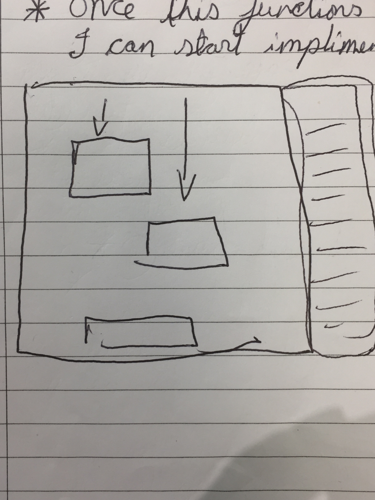

# spartaCoreProject1
Sparta Core - Project 1

- [My Game](#my-game)
- [Software Tools](#software-tools)
- [Specification](#specification)
- [WireFrame](#wireframe)
- [Approach](#approach)
- [The Game](#the-game)
- [Rules](#rules)
- [Game SnapShots](#game-snapshots)

## My Game:
[Color Typo](https://melson012.github.io/spartaCoreProject1/)

### Software Tools
This game was made using javascript, through the use of subline Text editor. HTML, CSS was also used to create the overall game interface and design. To manage this project, I worked with the use of online note pad, Trello. Trello allows me to mange my various sprint cylces and set strick deadlines. This kept me on track with amount of wokr to be done and to acutally dliver on time. Github was also utilised to manage my progress with the client, it allowed me to develop bit by bit before pushing it live. It was used for Double checking with the client if all functionality is working as for the requriments.    

### Specification
The Project requirements was very basic, to create a browser game through the use of HTML, CSS and Javascript. 

Include an instruction section explaining how to play the game.
Ether display a message when the user has won or display the users score after the game has finished.
Be hosted online!
BONUS

- Your game could include a leaderboard.
- Your game could be 2 player.
- Your game could be played against the computer...
- You could include some fancy animations in your game...
- You could into HTML5 Audio and include some snazzy sound effects...

### WireFrame

### Approach
The way I Approached this project was by identifying what my game would be, an idea that has a basic logic of the requriments. I collected multiple ideas, before persenting it to my client. After the client was satisfied with one of my ideas, I then began my project execution. First I built wireframes for the game, this helped me improvise on what it should look like before implementing it. Identifying the game logic was vital as it would determine on what I would need in my game and how long will it take to implement the features. I utilised trello to clear my appraches on differnet tasks, this helped me be more organised with all my main objectives. And through the use of Agile management I was able to keep contact with the client and receiving vital feedbacks he wanted to be implemented in every process development of the game. 

### The Game
Color Typo is a very basic simple game, yet exciting and challenging. This is what makes it more playable. The theme of the game is colour, and everyone loves colours but not everyone can type fast and correctly spelled,'Typo'. This is where both combied makes this a very unique game. 
#### Rules
The rules are very basic, avoid teh blocks hit the bottom of the screen, if so you will lose a life. You have three lives, repersented has hearts on the left hand side of the game screen. If correctly inputed the matching block will disappear and avoid the user losing a life. Every 10 points gain you go up a level and the diffuclty inscreases.   

### Game SnapShots

#### Challanges Faced
One of biggest challanges faced was on how to get the blocks moving down and then detecting the bottom of the screen. with that I could determine when the user will lose a life. It was the biggest challenge as I have never used javascript before and for it to be my first time I am quite proud on what I have achieved.  

#### Conclusion
In conlusion the porject was a success, as I tested out the product with many users and they loved it. I belive, I successfully achieved all the requirements with the bonuses, which makes my end product even more specified to what my client wanted. This was also achieved through a god communication between me and the client. Overall, the end product was delivered successfully.   

#### Further Improvements
Improvements could be implemented in terms of long term and better usablity. I belive, the colour theme of the game could be a bit more specific to the game as i feel like it is very unrelated. The local stroage could be improved by storing more then one player score and not just only one top score. However, all the improvemnts above is not major and will not affect the fuctionality of my game therefore, this shows it was a success on covering all aspect of the game that could put off any users on using it.
